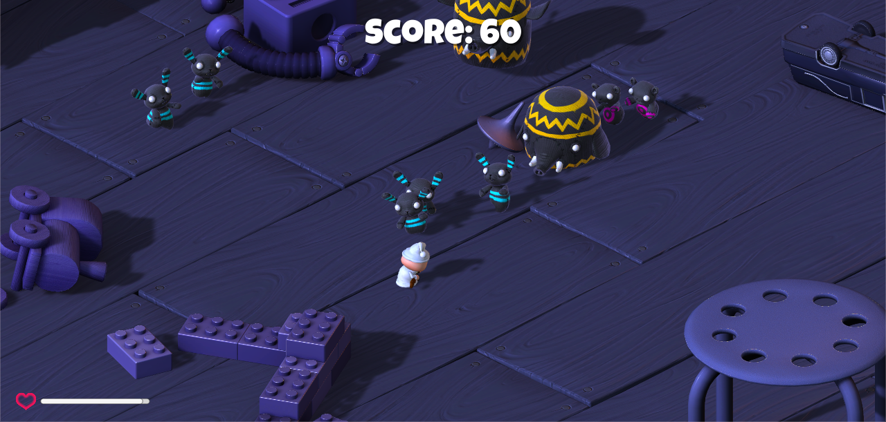

#Survival-Shooter
My implementation of the Survival Shooter game from Unity official tutorials. Used to learn C# syntax and intermediate Unity concepts like NavMeshes, MechaAnim, Animator Controllers and GUI.

